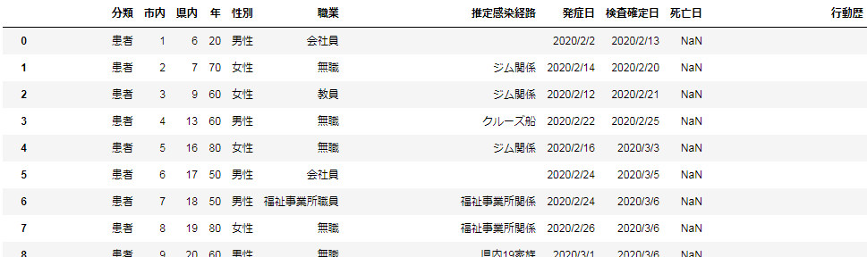
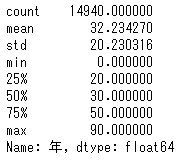

# COVID-19
千葉県市川市における新型コロナウイルス関連のレポジトリです。

## データ
[市川市のホームページ](https://www.city.ichikawa.lg.jp/pub01/hasseijokyo.html)では、オープンデータとして二次利用できる形式で情報を公開していないため、こちらでまとめさせていただいています。
随時更新していますが、個人的な事情で遅れることがあります。
CSVフォーマットで、文字コードはUTF-8です。

### カラム
カラムの意味は以下の通りです。

- 分類
  - 患者（発症済み）か無症状病原体保有者（未発症）です
- 市内
  - 市川市在住者で感染が見つかった順番です
- 県内
  - 千葉県在住者で感染が見つかった順番です
- 年
  - 年齢（10歳単位）です
  - まだ0～9歳の感染者はいません
  - 「90」は90歳以上を表します
- 性別
  - 男性または女性です
- 職業
  - 感染者の職業です
  - 空欄があります
- 推定感染経路
  - 感染した場所です
  - 「県内○○」の「○○」は千葉県で感染が見つかった順番です
  - 空欄があります
- 発症日
  - 発症した日です
  - 無症状病原体保有者は空欄です
- 検査確定日
  - PCR検査で陽性が確定した日です
- 行動歴
  - 感染後の行動です
  - 空欄があります

## サンプル
データを使用した解析のサンプルコードです。
Jupyter Notebookになってます。

